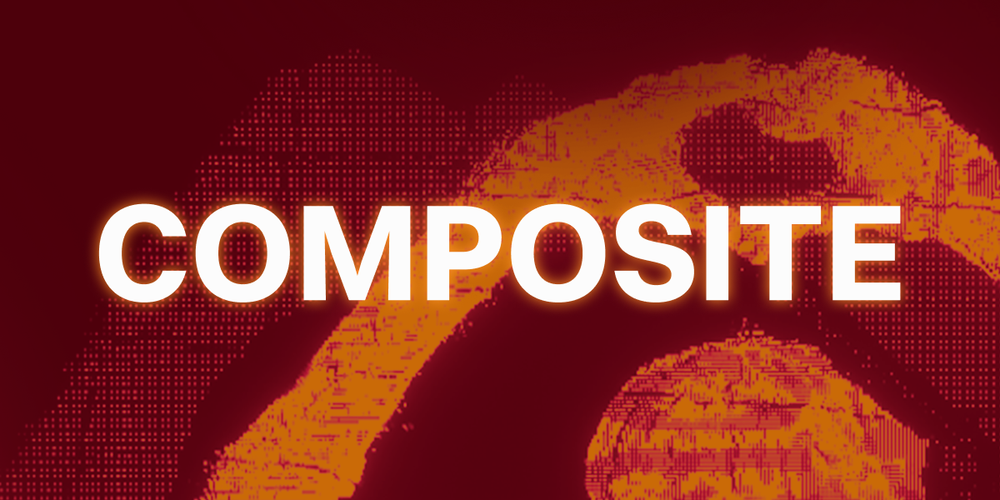

# Composite



**Composite** is an interactive installation created with **TouchDesigner** and a **Kinect** sensor. The project was developed to celebrate the **10th anniversary of Les Papeteries – Image Factory** in **Cran-Gevrier, Annecy**.

## Concept

Composite is a **3x3 mosaic of visual effects**, each tile running a unique, real-time effect that reacts to body movement and depth data captured by the Kinect. The installation invites visitors to explore and interact with a dynamic collage of generative visuals.

## Setup Instructions

To run the project properly, please ensure the following installation is in place:

- A **Kinect v2** (or compatible version) is connected and functioning.
- A computer with **TouchDesigner** and **MadMapper** installed (Kinect compatible build).
- The file `composite.toe` is opened in TouchDesigner.
- The **user interaction zone** should allow for proper Kinect tracking (approximately 2–3 meters in front of the sensor).
- Use a **large screen or projector** for the best visual experience.

### Installation Workflow

1. TouchDesigner processes Kinect input and runs the 9 real-time visual effects.
2. Each tile of the 3x3 mosaic is sent individually via **Spout** (one stream per tile).
3. In **MadMapper**, each Spout stream is received and mapped to a specific physical output in the installation layout.
4. MadMapper handles the final projection or screen distribution for public display.

This setup allows full flexibility in positioning and mapping each visual tile on the installation space, independent of the TouchDesigner composition window.

## Project Structure

```
composite/
├── Assets/        # Assets used in some filters (images, videos, etc.)
├── Filters/       # All individual effects used in the 3x3 mosaic
├── composite.toe  # Main TouchDesigner project file
├── ins.mad        # Main MadMapper project file
└── README.md
```

## Filters and Modularity

All the visual effects used in the mosaic are **modular and reusable**. They can be found in the `Filters/` directory. Each filter is self-contained and can be modified or reused in other projects.

> ⚠️ **Important:** If some effects are not displaying properly, it may be due to missing or incorrectly linked assets. Make sure all required files from the `Assets/` folder are properly referenced within the corresponding filter.

## Screenshot


